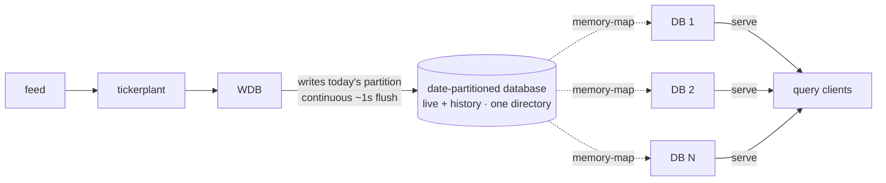

# TorQ No-RDB Starter Pack

A runnable TorQ system with **no RDB/HDB split, and no gateway**, live and historical data live in one on-disk database served by any number of identical **DB** processes. A companion to the [_Who needs an RDB?_](https://dataintellect.com/blog/who-needs-an-rdb/) blog post.  No stinking rdbs!

## The idea

A standard kdb+ stack splits your data across tiers: a real-time database (RDB) holds today's data in memory, a historical database (HDB) holds everything before it, a writer persists the day to disk, and a gateway sits in front to route each query to the right place and stitch the results back together.  Sometimes you even have a third intraday tier in between (IDB).  It works, but it's a lot of moving parts, and every one of them is something to configure, connect, monitor, and reason about.  In particular I've always disliked the fact that the RDB/HDB split means you lose the ability to simply write q-sql queries on your data: you always need an extra layer of logic to do some joining, which can get surprisingly complex.  It loses some of its elegance, and for kdb+ where elegance and expressiveness are key, that's a big deal.

This pack asks a simple question: **what if you just... didn't split your data by default?**

The writer here writes today's partition *straight into the same date-partitioned database served by a set of identical reader processes* which, throughout this README, I'll simply call **DB**s. Live data and history become **one database**.  No move at end of day, no separate HDB, no "query the RDB for today and the HDB for the rest." And because that database is on disk, **any number of these DBs can memory-map it and serve queries in parallel**.  There's no single-threaded RDB, so there's no gateway needed to fan out across one. You're left with one uniform thing: a DB process that holds all the data, live and historical, that you can run one of or fifty of.

### Isn't on-disk slower than in-memory?

The single key fact here, is that **today's most recent on disk data will most likely be in memory**, just in the OS page cache instead of process memory.  On modern hardware (fast NVMe, plenty of RAM for the OS page cache), a memory-mapped on-disk table served from cache runs within roughly **0–20%** of the same data held in an in-memory RDB, for anything that isn't a small, *indexed* point-lookup (see [Benchmarks](#benchmarks) for more details). The RDB's big advantage narrows to that one case (covered under [Attributes](#key-design-choices) below), and in exchange you shed a great deal of complexity.

So the trade is really:

| | traditional RDB | no-RDB DBs |
|---|---|---|
| a *selective, indexed* query | **wins** (often by a lot) | scans instead *(unless `usememattr` is on)* |
| everything else (most scans, aggregates) | ~the same per query | ~the same per query |
| concurrent query **throughput** | single-threaded | **N DBs in parallel, sharing the OS page cache** |
| operational complexity | RDB + HDB + gateway | one DB process |

You give up a narrow single-query speed advantage and get back **throughput, flexibility, and — above all — simplicity.**

### Simplicity, simplicity, simplicity

Fewer processes is good for **operators** (less to deploy, monitor, and debug), good for **developers** (one data model, no split data to code around), and increasingly good for **agents**.  An LLM writing queries against this system doesn't have to know which tier holds which data, how the gateway routes, or where live stops and history starts. There's one place to look, which also makes the whole thing easy to stand up and drive with a coding agent.  Everyone can move faster.

## Architecture



No gateway. No RDB. No HDB. No end-of-day move. The tickerplant and writer are unchanged from any TorQ system. Everything downstream of the writer collapses into a set of identical DBs over one directory.

## Key design choices

A few deliberate changes make the single-database model work:

**Continuous flush.** The writer flushes to disk on a short timer: 1 second by default, and it can go lower. On-disk freshness is bounded by that interval, so the DBs are never more than ~a second behind live. (Shorten it for fresher data, at the cost of more frequent small writes and DB refreshes.) One consequence of refreshing this often: each DB reloads the sym file whenever it grows, so keeping the symbol universe tight matters far more here than in a coarse batch-flush setup. A bloated or ever-growing sym file becomes a reload cost you pay every second rather than every few minutes.

**Two read modes.** By default, kdb+ [memory-maps](https://kx.com/blog/memory-mapping-in-kdb/) the partition files a query needs *at query time*, mapping them in just before the query runs and releasing them afterwards. That per-query mapping is cheap but not free, and the cost grows with the number of partitions and columns each query touches. Each DB here runs in one of two modes:
- **mapped** (the default) — maps the whole database once (via `.Q.MAP`) and keeps it mapped, refreshing only the live partition on each flush, so reads skip the per-query mapping entirely. Fastest reads; query latency stays flat as history grows.
- **deferred** — the stock kdb+ behaviour above: re-map per query. Slower, and increasingly so as history grows, but simple and always fresh.

The mode is a per-process flag, `-.idb.usemapping` (`1` = mapped, the default; `0` = deferred), set in the `extras` column of `process.csv` — see `bench/process.csv`, which runs one DB each way. A second per-process flag, `-.idb.usememattr`, adds an in-memory index for the live partition on top of mapped mode — see [Attributes](#key-design-choices) below.

Both serve identical results; mapped is just faster. On the [benchmark](#benchmarks)'s single-day, 50M-row database, deferred costs **5–50% more per query** depending on the query; least on compute-heavy aggregates, where the mapping cost is lost in the work, and most on cheap scans, where it dominates. That gap widens with the number of partitions and columns each query touches, so on a database with real history it will be larger than these one-partition figures suggest.

**Page cache (where the data actually lives.)** Today's partition is warm as a *side effect of writing it*: the WDB has just written those pages, so they're already resident before any DB reads them, and because the cache belongs to the kernel rather than to any one process, every DB shares it instead of each holding its own copy. That's what makes the freshest data (which is also the most-queried data) free to serve. If you want to manually control exactly what stays in the page cache you can: tools like [`vmtouch`](https://hoytech.com/vmtouch/) will pull a directory into cache (`vmtouch -t`) or pin it there (`vmtouch -l`). The pack deliberately doesn't, leaving it to the kernel, which is the right default for most workloads.

**Attributes (the one place the RDB still wins — mostly.)** kdb+ attributes like `g#` (grouped) make selective lookups on a column near-instant, but an index-carrying attribute **can't be maintained on an on-disk column that's being appended to**: the index lives in a footer after the data, so kdb+ drops it on every append rather than shift it under any memory-mapped reader. So *today's* partition has no index: an intraday `where sym=AAPL` scans it. An in-memory RDB keeps `g#` on `sym`, so it wins those selective intraday lookups, sometimes by 100×+. At end of day this pack sorts the day's partition and applies a `p#` (parted) attribute, so every *previous* day gets fast lookups too; only the live day is un-indexed. And if a handful of selective live queries genuinely matter, the no-RDB model doesn't stop you adding a small, *targeted* in-memory cache or CEP process for just those, which is much less resource intensive than full general-purpose RDB.

That limitation is specific to *disk* — in memory, `g#` survives an append fine. So there is now an **experimental, opt-in** overlay (`-.idb.usememattr 1`, default off, mapped mode only) that keeps a heap-resident `g#` copy of the indexed column(s) for the live partition and splices it into that partition's map in place of the on-disk column, leaving every other column mapped. The engine sees a genuine attribute, so it's fully transparent: plain q-sql, `by sym`, `aj`, and queries with no date filter all benefit with no change at the call site — `p#` serves history, in-memory `g#` serves today. The copy is derived from the disk file on each flush, appending only the new rows, so there's no second source of truth and no writer changes. Which columns get it comes from `sort.csv`, the same file the EOD sort uses to place `p#`.

It isn't free: roughly 24 bytes per row per process (~1.1 GB for a 50M-row day), and unlike the mapped columns that memory is *private to each DB* rather than shared page cache, so N DBs pay it N times. Enable it on readers serving selective lookups and `by sym` aggregation, which both get faster; leave it off on ones dominated by large scans of *un-indexed* columns, which get ~10–25% slower (see [Benchmarks](#benchmarks)). Being per-process, it's easy to run a mixed fleet over the same directory — some DBs indexed, some lean. It leans on `.Q.pm`, which is undocumented, and has a known gap around the end-of-day partition swap — hence off by default. See [`code/idb/mapping.q`](code/idb/mapping.q).

**End-of-day rollover.** Sorting the live partition is a little tricky: there's no gateway to hold queries and no separate HDB to move to as the DBs are serving the very partition being sorted. So the pack copies today's partition to a hidden staging directory, sorts the *copy*, then swaps it in with two atomic renames. DBs never observe a half-sorted state, and mapped DBs keep serving right across the swap. Zero downtime, no gateway required.

## Benchmarks

The `bench/` directory compares this design to a traditional RDB on the same data. Representative figures on a **50M-row synthetic trading day** (server-side ms per query; reproduce with `bash bench/run.sh`):

| query | 1 RDB | 1 mapped DB | 1 mapped DB + `usememattr` | 4 DBs in parallel |
|---|---:|---:|---:|---:|
| selective lookup, **indexed** col (`sym`, ~5k rows) | **0.5** | 392 | **0.6** | 101 |
| selective lookup, **un-indexed** col (`tradetime`, ~5k rows) | 124 | 118 | 136 | 33 |
| aggregate (`avg`/`sum` by `sym`) | 590 | 660 | 576 | 181 |
| filtered aggregate | 1247 | 1153 | 1184 | 296 |

Important notes:

- **The RDB's edge is the *index*, not memory.** That makes sense since, of course, the DBs are *also* ideally serving from memory, just the OS page cache the memory-mapped files live in, instead of the RDB's own heap. Both are reading RAM; the only real difference is the index. Same 5k-row result, in memory both times: *with* an index it's 0.5 ms, *without* one it's 124 ms — a full scan, right in the DBs' ballpark. Memory alone buys almost nothing. The third column is the proof: give the DB the same index and it lands at 0.6 ms, on the same on-disk data.
- **`usememattr` closes that gap, at a price.** The in-memory attribute (column 3, off by default — see [Attributes](#key-design-choices)) takes the selective indexed lookup from 392 ms to 0.6 ms, a large indexed lookup (2.5M rows on `sym`) from 588 ms to 235 ms, and `by sym` aggregation from 660 ms to 576 ms — all to RDB parity or better, since the grouping reads straight off the index. It is not free everywhere: a large scan of an *un-indexed* column that also returns the indexed one runs ~10–25% slower, and the RDB shows the same pattern, so it looks like the ~1.1 GB of private heap displacing page cache rather than anything about the attribute itself.
- **On anything that scans, one DB ≈ one RDB** (within ~0–20%, sometimes even slightly faster), and **four DBs beat the single RDB 3–4×**. The RDB is single-threaded, the DBs aren't.
- **The numbers above compare the average time for one query over multiple runs.**  This is particularly important to note for the column with 4 DBs.  These numbers cleanly scale to 3-4x faster **if you need to run 4 queries**.  For a single query, having 4 processes obviously does not help you.  Query **throughput** goes up: four DBs serve a fixed batch of queries **~3.6× faster** than one RDB.

**What about write throughput?** Writes go through the tickerplant either way, and *that* is the shared bottleneck. An RDB inserting into memory is faster than a WDB writing to disk when you compare the two in isolation — but end-to-end, both sit behind the same TP, so overall ingest capacity comes out similar. You don't lose write performance by dropping the RDB.

### Running the benchmarks

`bench/run.sh` is self-contained: it brings up a fuller topology (extra DBs plus an RDB for comparison, from `bench/process.csv`), seeds ~50M rows, runs the latency matrix and throughput benchmarks, and tears everything back down.

```sh
bash bench/run.sh
```

It spins several processes up and down and moves a lot of data around; exactly the sort of multi-step, environment-heavy task that's easiest to drive with a coding agent (e.g. Claude Code), which can run it, interpret it, and make small changes for you if required.

## When an RDB still makes sense

This isn't "never use an RDB." If your workload is dominated by **highly selective point-lookups on indexed columns against live data**, and low latency on *those* matters above all else, a small in-memory RDB, or a targeted cache, genuinely wins. An RDB-centric stack shouldn't be the *default* you reach for without thinking, not that it's never the right tool.

## Set Up

This pack is an application overlay that runs on top of a [TorQ](https://github.com/DataIntellectTech/TorQ) checkou. TorQ supplies the framework and process code, this repo supplies the no-RDB config and the custom WDB/database code that layers on top.

### Prerequisites

- The community edition of [KDB-X](https://code.kx.com/kdb-x/get_started/kdb-x-install.html) (or a licensed kdb+ 4.1+) installed and available on your PATH as `q`.
- A local checkout of [TorQ](https://github.com/DataIntellectTech/TorQ).

### Configure

Clone this repo, then edit the two path variables at the top of [`nordb-env.sh`](nordb-env.sh) to point at your checkouts:

```sh
export TORQHOME=/path/to/TorQ                        # the TorQ core checkout
export TORQAPPHOME=/path/to/TorQ-No-RDB-Starter-Pack # this repo
```

Everything else is derived from those two. No other files need editing.

### Run

Start the stack from your TorQ checkout, pointing `SETENV` at this pack's env file:

```sh
SETENV=/path/to/TorQ-No-RDB-Starter-Pack/nordb-env.sh /path/to/TorQ/torq.sh start all
```

This brings up the minimal no-RDB stack: a tickerplant, a writer (WDB), a sort process and a single memory-mapped DB, plus the discovery service and a feed. Stop it with the same command and `stop all`:

> **A note on naming.** What this README calls a **DB** is, in the config, a TorQ **IDB**: the processes are `proctype idb` with names `db1`, `db2`, … (see [`appconfig/process.csv`](appconfig/process.csv)). TorQ's intraday-database process already does most of what's needed here: it serves an on-disk partition and reloads it when the writer flushes, so the pack builds on it rather than adding a new proctype. That's also why the read-mode settings and code live under `appconfig/settings/idb.q` and [`code/idb/`](code/idb/mapping.q). The difference is what it points at: a stock IDB serves a separate intraday directory, while here `savedir`, `hdbdir` and the DBs' database are all one directory, so these IDBs serve live *and* history.

```sh
SETENV=/path/to/TorQ-No-RDB-Starter-Pack/nordb-env.sh /path/to/TorQ/torq.sh stop all
```

Processes listen from `KDBBASEPORT` upward; connect to any of them with the default credentials `admin:admin`.

### The feed

[`code/tick/feed.q`](code/tick/feed.q) (adapted from the [TorQ Finance Starter Pack](https://github.com/DataIntellectTech/TorQ-Finance-Starter-Pack)) is a fake market-data generator: random trades and quotes across ten well-known tickers, published to the tickerplant every 200ms. It's there so a fresh `start all` gives you a system with data actually moving through it — feed → TP → WDB → disk → DB — rather than an empty database to stare at. Query any DB a second after startup and today's rows are already on disk and visible.

It's a demo source, not a load generator: a few hundred rows a second, enough to watch the pipeline work. The benchmarks deliberately bypass it and seed the database directly (see [Running the benchmarks](#running-the-benchmarks)).

## Community License Limits

The KDB-X [community edition](https://code.kx.com/kdb-x/releases/release-notes-latest.html#2-qlim-resource-limits) caps resources such as concurrent connections and memory. The default setup in this pack is deliberately an absolute minimum — a tickerplant, a writer, a sort process and a single DB, plus the discovery service and the feed — so it starts comfortably within those limits. You can add processes back (extra DBs, a gateway, monitoring, and so on) as your license allows.

Because this is a no-RDB architecture, live data is served straight from disk rather than held in an in-memory RDB, so overall memory use _by kdb+_ is lower than an equivalent RDB-based setup — making it easier to stay within the community edition's limits. (The optional in-memory attribute overlay trades some of that back — see [Attributes](#key-design-choices).)
